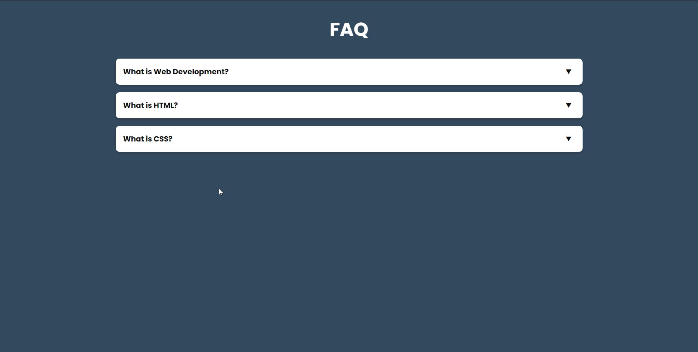
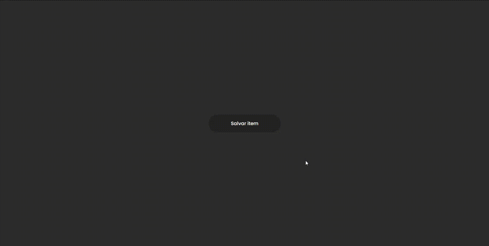
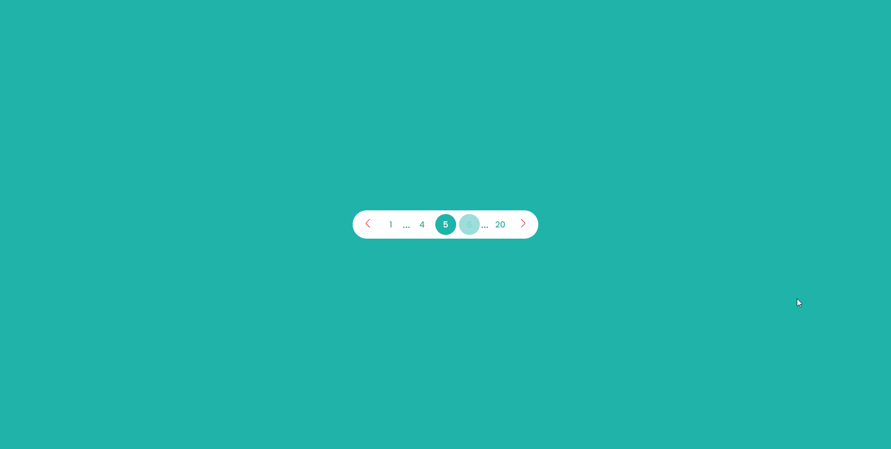
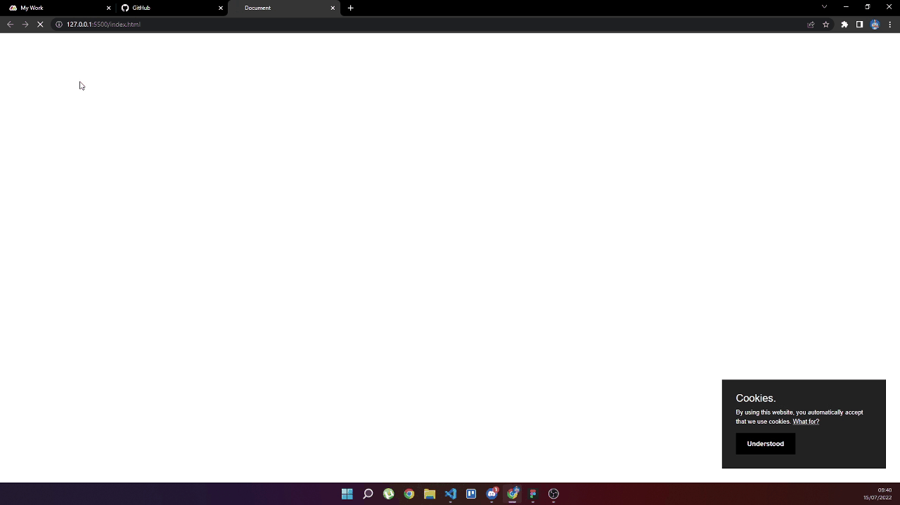

# CSS Tricks, macetes, facilidades e skills CSS

## 1 - Accordion-dropdown
### <a href="./accordion-dropdown">Accordion-dropdown<a>

## 2 - Button Loading
### <a href="./button-with-loading">Button Loading<a>

## 3 - Pagination
### <a href="./pagination">Pagination<a>

## 3 - Cookies
### <a href="./cookies-privacidade">Cookies de Privacidade<a>

## 3 - Fancybox
### <a href="./Fancybox">Cookies de Privacidade<a>

